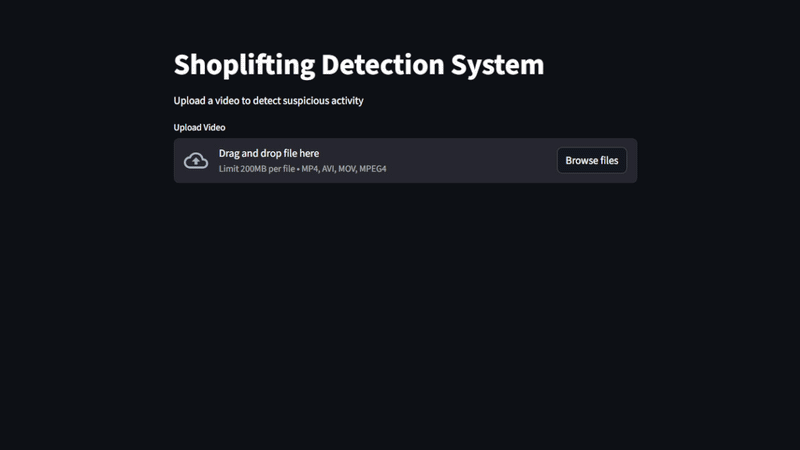

# Shoplifting Detection System

## Demo

Place a demonstration file inside:

```id="u1k0pz"
/demo/demo.gif
```

Then embed it:



---

## Overview

This project implements a full-stack AI-powered system for detecting shoplifting behavior from video sequences. It integrates deep learning, backend API development, and an interactive frontend into a unified production-style pipeline.

The system leverages a convolutional neural network with temporal modeling to analyze video frames and classify activities as either normal or shoplifting. The backend is implemented using Django REST Framework, while the frontend is built with Streamlit for rapid interaction and visualization.

---

## Key Features

* End-to-end video classification pipeline
* Deep learning model using transfer learning (MobileNetV2)
* Temporal sequence modeling using TimeDistributed layers
* RESTful API for inference (Django)
* Interactive frontend interface (Streamlit)
* Efficient frame sampling and preprocessing
* Modular and scalable project structure
* Production-oriented design decisions

---

## Project Structure

```id="w1a9f2"
Shoplifting Detection/
│
├── backend/                          # Django backend (API + inference engine)
│   ├── api/
│   │   ├── views.py                  # Video upload & prediction endpoint
│   │   ├── model_loader.py           # Model architecture + weights loading
│   │   ├── urls.py
│   │   └── ...
│   ├── config/                       # Django project configuration
│   ├── requirements.txt              # Backend dependencies
│   └── manage.py
│
├── frontend/                         # Streamlit frontend
│   └── app.py
│
├── models/                           # Trained model weights
│   └── video_classification_model.h5
│
├── notebooks/                        # Training & experimentation
│   └── deepguard-shoplifting-detection-via-transfer-lear.ipynb
│
├── demo/                             # Demo media (GIF / video)
│   └── demo.gif
│
└── README.md
```

---

## System Architecture

The system follows a client-server architecture:

1. The user uploads a video via the Streamlit interface
2. The frontend sends the video to the Django REST API
3. The backend extracts frames and constructs a fixed-length sequence
4. The deep learning model processes the sequence
5. The prediction result is returned as JSON
6. The frontend displays the classification result

---

## Model Architecture

The model is designed for video classification using spatial and temporal feature extraction:

* Backbone: MobileNetV2 (pretrained on ImageNet)
* Input: (20, 128, 128, 3)
* Feature extraction: TimeDistributed(MobileNetV2)
* Spatial pooling: GlobalAveragePooling2D
* Temporal aggregation: GlobalAveragePooling1D
* Fully connected layers with dropout regularization
* Output: Sigmoid activation for binary classification

---

## Design Considerations

* The model architecture is rebuilt programmatically instead of using `load_model` to avoid serialization incompatibilities across TensorFlow/Keras versions
* Lazy loading is implemented to prevent repeated model initialization
* Frame sampling ensures consistent input size regardless of video length
* Padding is applied for short sequences to maintain model input constraints
* Backend and frontend are decoupled for scalability and flexibility

---

## Installation

### Requirements

* Python 3.10
* TensorFlow 2.10
* NumPy 1.23.5

---

### Setup

```bash id="k9r8tz"
# clone repository
git clone <your-repo-url>
cd Shoplifting Detection

# create virtual environment
python -m venv venv
venv\Scripts\activate

# install backend dependencies
pip install -r backend/requirements.txt
```

---

## Running the Application

### 1. Start Backend Server

```bash id="3c82yl"
cd backend
python manage.py runserver
```

Backend endpoint:

```id="e5n0zt"
http://127.0.0.1:8000/api/predict/
```

---

### 2. Start Frontend Interface

```bash id="7t4s2y"
cd frontend
python -m streamlit run app.py
```

Frontend URL:

```id="2w1b8z"
http://localhost:8501
```

---

## API Specification

### Endpoint

```id="pjq1z0"
POST /api/predict/
```

### Request

* Content-Type: multipart/form-data
* Payload:

  * file: video file (mp4, avi, mov)

### Response

```json id="a4n9rz"
{
  "prediction": 0.72,
  "label": "Shoplifting"
}
```

---

## Inference Pipeline

1. Video is temporarily stored
2. Frames are sampled uniformly across the video
3. Frames are resized to 128x128 and normalized
4. A sequence of 20 frames is constructed
5. Sequence is passed to the model
6. Prediction is returned as probability score


---

## Future Work

* Real-time inference using webcam streams
* Model optimization (quantization, pruning)
* Deployment using Docker and cloud services
* Explainability using Grad-CAM
* Multi-class activity detection
* Performance benchmarking and monitoring

---

## Authors

* **Armia Gamal**
* **Sara Essam**

**Computer Science & Statistics Students**

**AI & Computer Vision Engineers**

---

## License

This project is intended for educational and research purposes only.
